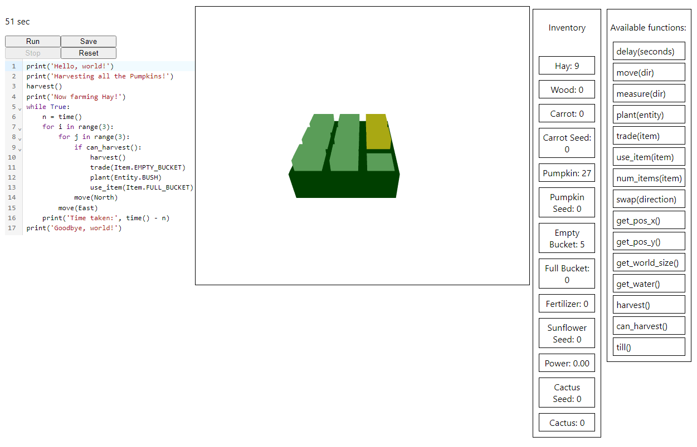

# The Farmer was Replaced Clone

This project is a clone of the game "The Farmer was Replaced". The original game can be found on Steam. This project was created for educational purposes only.

The main logic and game loop are implemented. As I couldn't find a good interface to write the python code in game in unity, unreal, godot nor any python engine, I decided to implement it in React to use the CodeMirror editor. As the main code in the game is written in a very python like language, I decided to run the python execution in the browser using brython. Communication between the python code and the react app is done using the window object.

Most of the functionality is implemented, like items, entities, most user functions, farming of hay, bushes, trees, carrots, pumpkins, sunflowers and cacti, loading and saving, fertilizer and water, trading etc...

The largest missing part are the good visuals and the upgrade system.

## TODOs

- Upgrade Tree
- Visuals
  - Entities
  - Items
  - Tiles
  - Background
  - UI
    - Inventory
    - Split into multiple code windows
      - Extract the functions and make them available in the other code windows
      - Better code theme (dark mode)
    - Upgrade Tree
    - Camera interaction
- Maze?
- Dinos?
- Automation of upgrades?
- Leaderboard?

## `npm start`

Runs the app in the development mode.\
Open [http://localhost:3000](http://localhost:3000) to view it in your browser.

The page will reload when you make changes.\
You may also see any lint errors in the console.

## Display

